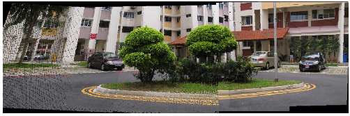

### Helper Class For Panaroma Stitching

This Repository implements helper function from scratch to estimate correspondences between two images and estimate Homography matrix. This can be the used to stitch Images to make a panaroma.

<p align="center">
    
</p>

### Usage
```
instance=PanaromaStitcher()
```

##### Correspondence Between Image Pairs

This method takes ImagePair as input and finds Correspondence based on Given Algorithm (SIFT,SURF). Correspondences below threshold level are rejected,set by giving diatance ratio.   


  

```
instance.FindCorrespondences(ImagePair, Algo='SIFT', ratio=0.75)

CORRESPONDING POINTS IN IMAGES CAN BE OBTAINED AS
instance.ptsA  -----> instance.ptsB
```

##### Find Homography Matrix
Finds Homography matrix based on correpondence points found for the Image pair. Fails if matched points are less than four. Uses RANSAC method to detect outliers in correspondences and reject them during computation.

```
instance.FindHomographyMatrix()

HOMOGRAPHY MATRIX:
instance.H

```
##### Stitching

Stitches Image based on Homography matrix. Gives option whether stitch from left or right.

```
instance.ImageStitcher(stitch='R')

Returns: Stitched Result
```

### Demo

```
Run Source/test.py to stitch Images in 'Images' folder.
```
Also inbuiltFuncPanaroma() Function is given in demo which uses cv2 inbuilt function cv2.findHomography, cv2.RANSAC and cv2.warpPerspective function to obtain Panaroma.
Final Results can be compared.

### Dependencies

-- opencv + opencv contrib [To use SIFT and SURF]
-- imutils
-- matplotlib

